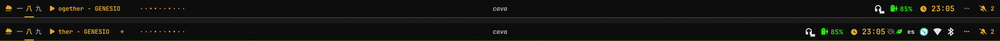
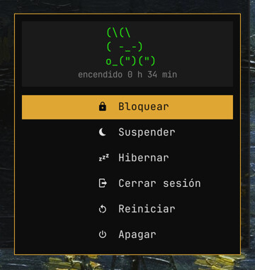

# dotfiles · aKali

🌐 [English](README.md) · **Español**

Mi escritorio **Sway** en Fedora: barra waybar con tiempo de AEMET, notificaciones con swaync,
widget de escritorio con eww, selector de fondos con miniaturas en rofi y terminal foot con
cabecera de fastfetch. Paleta oscura con **color de acento intercambiable** (10 temas, naranja por defecto).


## Capturas

Selector de temas de color (`Super+Alt+T`) y algunos de los 10 temas. El color de acento cambia a la vez
en sway, waybar, swaync, rofi, eww, foot y fastfetch:


| Panel de swaync (`Super+N`) | Notificaciones emergentes |
|---|---|
|  |  |

Selector de fondos con miniaturas (`Super+Alt+W`) y dos ejemplos de fondo con otro tema:


Terminal con pestañas y divisiones (`Super+Shift+Enter`, tmux): fastfetch a la izquierda y el historial de git a la derecha:


Chuleta de atajos (`Super+F1`), con el color del tema activo:


ranger con previsualización de imágenes en el terminal:


Barra minimalista: CPU, RAM y temperatura solo aparecen con carga alta; la bandeja, el inhibidor, el perfil
de energía y el idioma van en un cajón (`⋯`, franja de abajo: abierto al pasar el ratón). Junto a la canción,
un minivisualizador de audio (clic derecho cambia entre 8 estilos); `Super+M` abre el grande (cava) con el
color del tema, como en la captura del escritorio de arriba:



Menú de energía (`Ctrl+Alt+Supr`): el conejo cambia de cara con cada opción, y Apagar / Reiniciar / Cerrar
sesión piden confirmación:



## Módulos

Cada carpeta es un paquete de [GNU Stow](https://www.gnu.org/software/stow/) y se puede instalar por separado.

| Módulo | Qué contiene |
|---|---|
| `sway` | Config de Sway, atajos, bloqueo/idle, menú de energía, script de fondos (`scripts/wallpaper.sh`) y la chuleta de atajos (`keybindings.conf`) |
| `waybar` | Barra minimalista con módulos propios (tiempo y avisos AEMET, batería, micro, webcam, actualizaciones, Proton VPN, minivisualizador de audio) y un cajón para el resto |
| `swaync` | Centro de notificaciones con botones rápidos, tiempo y calendario |
| `eww` | Widget de información en el escritorio |
| `rofi` | Lanzador de aplicaciones y selector de fondos con miniaturas (`wallpaper.rasi`) |
| `foot` | Terminal |
| `tmux` | Pestañas y divisiones para foot (atajos con `Alt`, color del tema) |
| `ranger` | Gestor de archivos en terminal con previsualización de imágenes (sixel, en foot) y de vídeos |
| `cava` | Visualizador de audio; sus colores se generan desde el tema (`config.base` + degradado del acento) |
| `fastfetch` | Cabecera del terminal (logo ASCII del conejo) |
| `zsh` | `.zshrc`, tema Powerlevel10k (`.p10k.zsh`) y autocompletados propios en `.zfunc/` (proton-drive) |
| `gtklock` | Pantalla de bloqueo |
| `thunar` | Atajos y acciones personalizadas del gestor de archivos (incluida "Analizar con ClamAV") |
| `dunst` | Notificaciones (alternativa a swaync) |
| `themes` | Temas de color: un archivo `.theme` por color de acento |
| `systemd` | Complemento del servicio de swaync que genera su `config.json` al arrancar y temporizador del análisis semanal con ClamAV |
| `clamav` | Script del análisis semanal de `~/Descargas` (avisa solo si encuentra algo) |

## Atajos destacados

| Atajo | Acción |
|---|---|
| `Super+F1` | Chuleta con todos los atajos |
| `Super+Alt+T` | Cambiar tema de color |
| `Super+Alt+W` | Selector de fondos con miniaturas |
| `Super+Alt+←/→` | Fondo anterior / siguiente |
| `Super+Alt+R` | Fondo al azar |
| `Super+N` | Panel de notificaciones |
| `Super+Shift+Enter` | Terminal con pestañas y divisiones (tmux) |
| `Alt+T` / `Alt+V` / `Alt+S` | En tmux: pestaña nueva / dividir al lado / debajo |
| `Super+M` | Visualizador de audio (cava) |
| `Ctrl+Alt+Supr` | Menú de energía |

## Instalación

```bash
# Dependencias (Fedora)
sudo dnf install sway swaybg swayidle waybar rofi swaync foot fastfetch gtklock thunar cava \
    stow jq curl libxml2 ImageMagick playerctl brightnessctl pulseaudio-utils \
    grim slurp satty wl-mirror wl-clipboard libnotify pavucontrol zsh tmux ranger chafa \
    jetbrains-mono-fonts fontawesome-6-free-fonts papirus-icon-theme
# Miniaturas de vídeo en ranger: ffmpeg (ffmpeg-free de Fedora o ffmpeg de RPM Fusion)
# eww no está en los repos de Fedora: ver https://github.com/elkowar/eww
# Powerlevel10k: git clone --depth=1 https://github.com/romkatv/powerlevel10k.git ~/.local/share/powerlevel10k
# Fuente de iconos: JetBrainsMono Nerd Font (https://www.nerdfonts.com)

git clone https://github.com/akalihullabaloo/sway-dotfiles.git ~/dotfiles
cd ~/dotfiles
stow sway waybar swaync eww rofi foot tmux ranger cava fastfetch zsh gtklock thunar themes   # o solo los que quieras
stow --no-folding systemd   # systemd no admite carpetas de complementos enlazadas
systemctl --user daemon-reload

# Opcional: análisis semanal de Descargas con ClamAV
sudo dnf install clamav clamav-freshclam && sudo systemctl enable --now clamav-freshclam
stow --no-folding clamav && systemctl --user enable --now clamav-semanal.timer

# Generar los colores del tema (imprescindible la primera vez)
~/.config/sway/scripts/theme.sh --current
```

Si ya existe alguno de esos archivos, `stow` avisa y no toca nada: muévelo antes a otro sitio.

### Temas de color

`Super+Alt+T` abre un selector con muestras de color. El script `sway/.config/sway/scripts/theme.sh`
genera un archivo de colores para cada programa (`colors.conf`, `colors.css`, `colors.rasi`…, que no
se suben al repo) y recarga sway, waybar, swaync, eww y cava. Las terminales nuevas usan el color nuevo.

Temas incluidos: Naranja, Ámbar, Rojo, Rosa, Morado, Azul, Cian, Menta, Verde Matrix y Monocromo.
Para crear uno, copia un archivo de `themes/.config/themes/` y cambia sus valores:

```bash
NAME="Mi color"
ACCENT="#rrggbb"          # color principal
ACCENT_BRIGHT="#rrggbb"   # variante clara (terminal)
```

### Panel de swaync

swaync no admite texto dinámico, así que los botones del tiempo y del calendario se escriben en su
configuración. Para no ensuciar el repo, la configuración editable es `swaync/.config/swaync/config.base.json`;
`config.json` lo genera `scripts/build-config.sh` (plantilla + textos guardados en `~/.cache/swaync-labels/`).
Tras editar `config.base.json`, ejecuta `~/.config/swaync/scripts/build-config.sh`.

### Fondos de pantalla

Los fondos no van en el repo. El script usa `~/Imágenes/Fondos/` (png, jpg, jpeg, webp); para otra
carpeta, define `WALLPAPER_DIR` (por ejemplo `WALLPAPER_DIR=~/Wallpapers wallpaper.sh select`).

### Tiempo de AEMET

Los módulos del tiempo necesitan una API key gratuita de
[AEMET OpenData](https://opendata.aemet.es/centrodedescargas/altaUsuario):

```bash
echo "TU_API_KEY" > ~/.config/waybar/aemet_api_key
chmod 600 ~/.config/waybar/aemet_api_key
```

Por defecto usa **Madrid capital como ejemplo**. Para tu ubicación, crea
`~/.config/waybar/aemet_location` (tampoco se sube al repo):

```bash
AEMET_MUNICIPIO="28079"   # código INE de tu municipio
AEMET_AREA="72"           # zona de avisos AEMET de tu comunidad
```

### Autocompletado de proton-drive

`zsh/.zfunc/_proton-drive` completa con TAB la
[CLI oficial de Proton Drive](https://proton.me/download/drive/cli/index.html)
(probado con la 0.8.0): grupos, comandos, opciones con sus valores y **rutas
remotas de Drive** (`/my-files/...`), que consulta a la propia CLI y guarda en
caché 2 minutos. Admite las abreviaturas de la CLI (`fs up` = `filesystem upload`).

```bash
# Instalar la CLI (binario único, sin dnf) y comprobar su SHA-512 con
# https://proton.me/download/drive/cli/version.json
install -m 755 proton-drive ~/.local/bin/proton-drive
proton-drive auth login
```

Necesita `jq` para las rutas remotas. `.zshrc` añade `~/.zfunc` al `fpath`
antes de `compinit`; si no aparece, borra `~/.zcompdump` y abre otra terminal.

## Notas

- Pensado para un portátil (salida `eDP-1`, batería `BAT0`); ajústalo si tu equipo es distinto.
- Fondo de la captura del terminal: fondo por defecto de Fedora 44 (versión noche), del equipo de diseño de Fedora, con licencia [CC BY-SA 4.0](https://creativecommons.org/licenses/by-sa/4.0/).
- Fondos de las demás capturas: cuadros de **dominio público** descargados de Wikimedia Commons:
  *Noche estrellada sobre el Ródano* (Van Gogh), *Dos hombres contemplando la luna* y *Salida de la luna
  sobre el mar* (Caspar David Friedrich), *La gran ola de Kanagawa* y *Fuji rojo* (Hokusai),
  *Takiyasha la bruja y el espectro esqueleto* (Kuniyoshi), *Impresión, sol naciente* (Monet) y
  *El Temerario remolcado a dique seco* (Turner).
