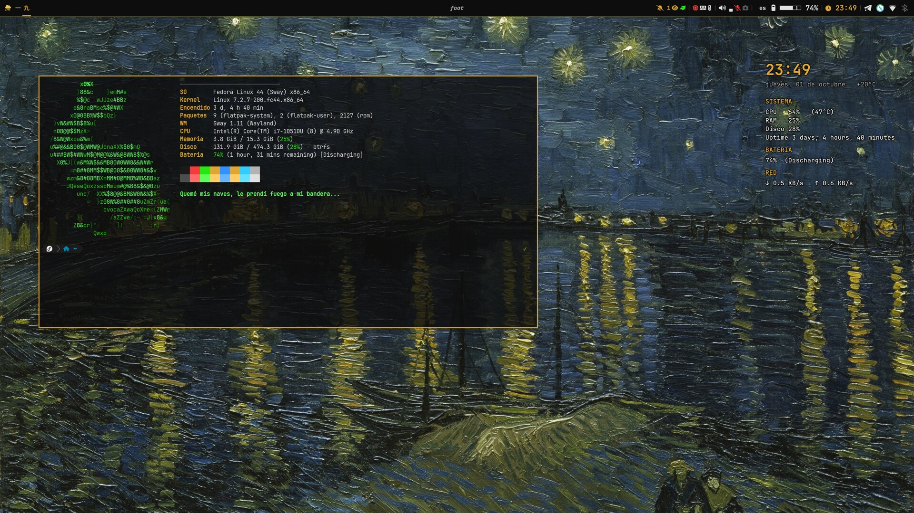
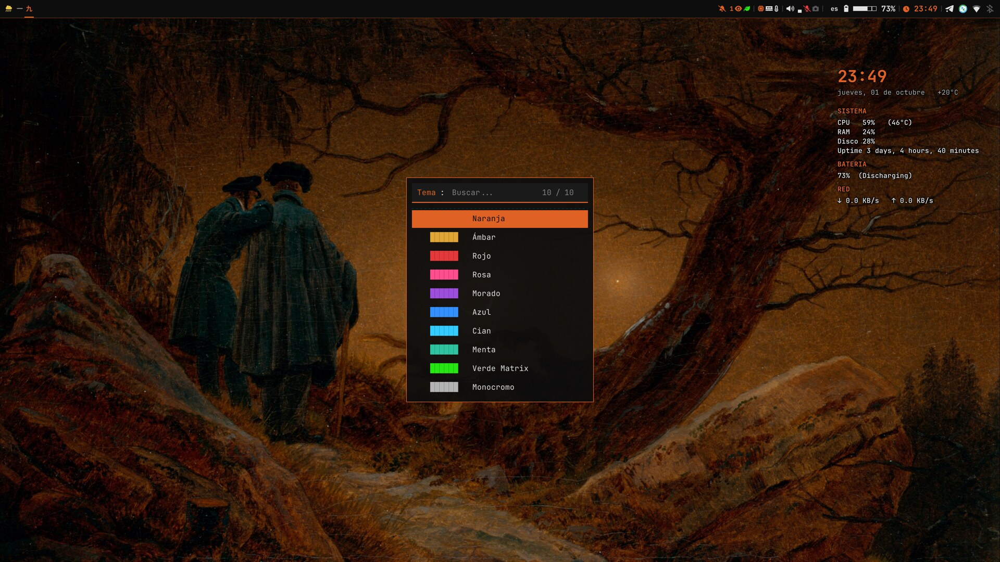
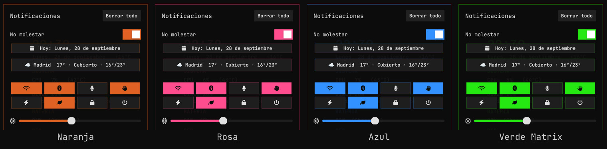
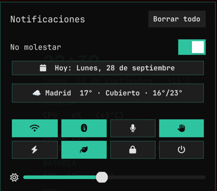
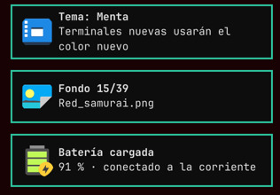
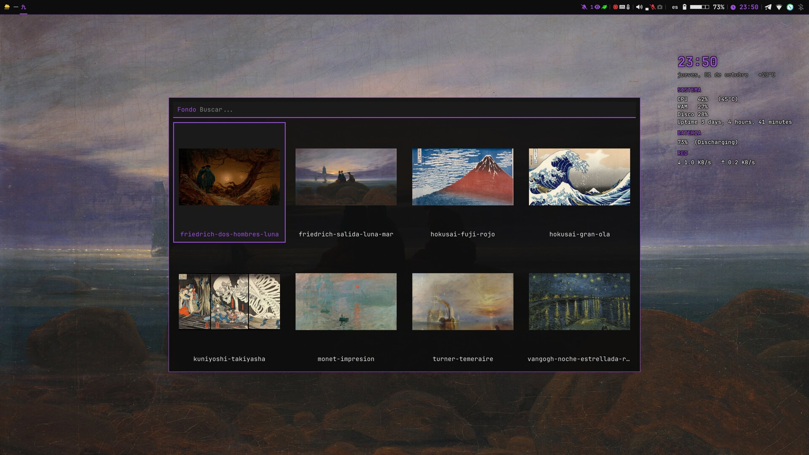
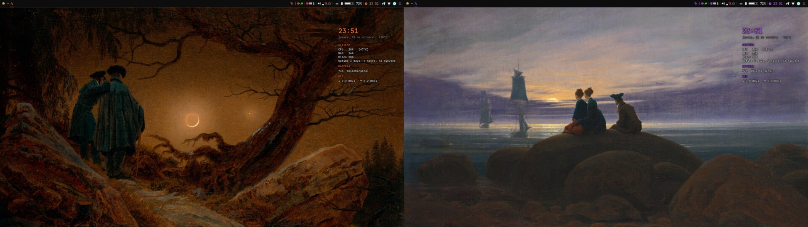
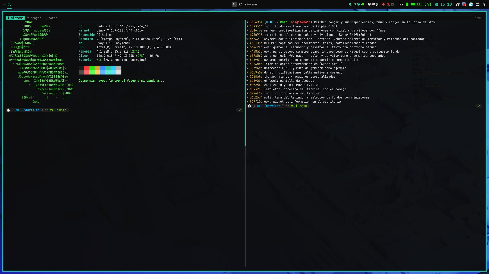
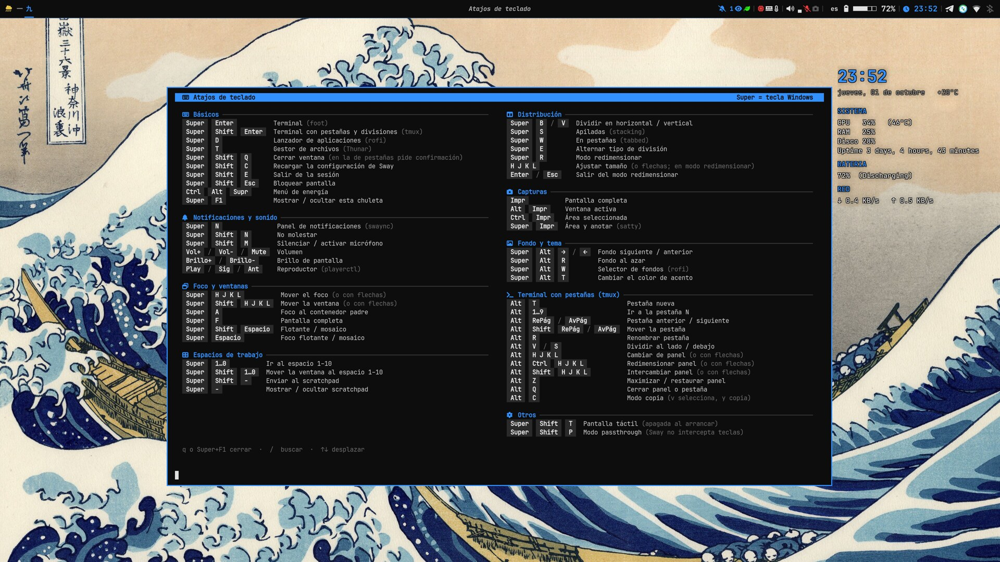
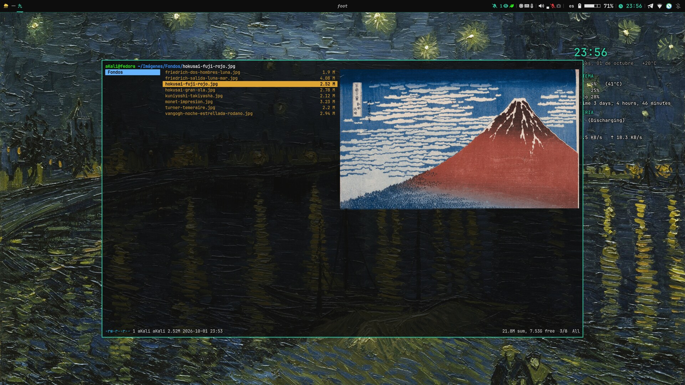

# dotfiles · aKali

🌐 **English** · [Español](README.es.md)

My **Sway** desktop on Fedora: waybar with weather from AEMET (Spain's weather agency), notifications
with swaync, a desktop widget with eww, a wallpaper picker with thumbnails in rofi and the foot terminal
with a fastfetch header. Dark palette with a **swappable accent color** (10 themes, orange by default).

> **Language:** the desktop itself (cheat sheet, notifications, menus and script messages) is in
> **Spanish**. Only this README is translated.



## Screenshots

Color theme picker (`Super+Alt+T`) and some of the 10 themes. The accent color changes at once in
sway, waybar, swaync, rofi, eww, foot and fastfetch:




| swaync panel (`Super+N`) | Pop-up notifications |
|---|---|
|  |  |

Wallpaper picker with thumbnails (`Super+Alt+W`) and two wallpaper examples with another theme:




Terminal with tabs and splits (`Super+Shift+Enter`, tmux): fastfetch on the left and git history on the right:



Keybinding cheat sheet (`Super+F1`), in the active theme color:



ranger with image previews in the terminal:



## Modules

Each folder is a [GNU Stow](https://www.gnu.org/software/stow/) package and can be installed on its own.

| Module | Contents |
|---|---|
| `sway` | Sway config, keybindings, lock/idle, power menu, wallpaper script (`scripts/wallpaper.sh`) and the keybinding cheat sheet (`keybindings.conf`) |
| `waybar` | Bar with custom modules (AEMET weather and warnings, network, battery, mic, webcam, updates) |
| `swaync` | Notification center with quick buttons, weather and calendar |
| `eww` | Desktop info widget |
| `rofi` | App launcher and wallpaper picker with thumbnails (`wallpaper.rasi`) |
| `foot` | Terminal |
| `tmux` | Tabs and splits for foot (`Alt` shortcuts, theme color) |
| `ranger` | Terminal file manager with image (sixel, in foot) and video previews |
| `fastfetch` | Terminal header (ASCII rabbit logo) |
| `zsh` | `.zshrc`, Powerlevel10k theme (`.p10k.zsh`) and custom completions in `.zfunc/` (proton-drive) |
| `gtklock` | Lock screen |
| `thunar` | File manager shortcuts and custom actions (including "Scan with ClamAV") |
| `dunst` | Notifications (alternative to swaync) |
| `themes` | Color themes: one `.theme` file per accent color |
| `systemd` | swaync service drop-in that builds its `config.json` at startup, and the weekly ClamAV scan timer |
| `clamav` | Weekly scan script for the Downloads folder (only notifies if something is found) |

## Highlighted shortcuts

| Shortcut | Action |
|---|---|
| `Super+F1` | Cheat sheet with every shortcut |
| `Super+Alt+T` | Change color theme |
| `Super+Alt+W` | Wallpaper picker with thumbnails |
| `Super+Alt+←/→` | Previous / next wallpaper |
| `Super+Alt+R` | Random wallpaper |
| `Super+N` | Notification panel |
| `Super+Shift+Enter` | Terminal with tabs and splits (tmux) |
| `Alt+T` / `Alt+V` / `Alt+S` | In tmux: new tab / split side by side / below |
| `Ctrl+Alt+Del` | Power menu |

## Installation

```bash
# Dependencies (Fedora)
sudo dnf install sway swaybg swayidle waybar rofi swaync foot fastfetch gtklock thunar \
    stow jq curl libxml2 ImageMagick playerctl brightnessctl pulseaudio-utils \
    grim slurp satty wl-mirror wl-clipboard libnotify pavucontrol zsh tmux ranger chafa \
    jetbrains-mono-fonts fontawesome-6-free-fonts papirus-icon-theme
# Video thumbnails in ranger: ffmpeg (Fedora's ffmpeg-free or ffmpeg from RPM Fusion)
# eww is not in the Fedora repos: see https://github.com/elkowar/eww
# Powerlevel10k: git clone --depth=1 https://github.com/romkatv/powerlevel10k.git ~/.local/share/powerlevel10k
# Icon font: JetBrainsMono Nerd Font (https://www.nerdfonts.com)

git clone https://github.com/akalihullabaloo/sway-dotfiles.git ~/dotfiles
cd ~/dotfiles
stow sway waybar swaync eww rofi foot tmux ranger fastfetch zsh gtklock thunar themes   # or just the ones you want
stow --no-folding systemd   # systemd does not accept symlinked drop-in folders
systemctl --user daemon-reload

# Optional: weekly ClamAV scan of the Downloads folder
sudo dnf install clamav clamav-freshclam && sudo systemctl enable --now clamav-freshclam
stow --no-folding clamav && systemctl --user enable --now clamav-semanal.timer

# Generate the theme colors (required the first time)
~/.config/sway/scripts/theme.sh --current
```

If any of those files already exist, `stow` warns you and leaves everything untouched: move them
somewhere else first.

### Color themes

`Super+Alt+T` opens a picker with color swatches. The script `sway/.config/sway/scripts/theme.sh`
generates a color file for each program (`colors.conf`, `colors.css`, `colors.rasi`…, not committed
to the repo) and reloads sway, waybar, swaync and eww. New terminals use the new color.

Included themes: Orange, Amber, Red, Pink, Purple, Blue, Cyan, Mint, Matrix Green and Monochrome
(named in Spanish in the picker). To create one, copy a file from `themes/.config/themes/` and change
its values:

```bash
NAME="My color"
ACCENT="#rrggbb"          # main color
ACCENT_BRIGHT="#rrggbb"   # light variant (terminal)
```

### swaync panel

swaync does not support dynamic text, so the weather and calendar buttons are written into its config.
To keep the repo clean, the editable config is `swaync/.config/swaync/config.base.json`; `config.json`
is built by `scripts/build-config.sh` (template + labels saved in `~/.cache/swaync-labels/`).
After editing `config.base.json`, run `~/.config/swaync/scripts/build-config.sh`.

### Wallpapers

Wallpapers are not included in the repo. The script uses `~/Imágenes/Fondos/` (png, jpg, jpeg, webp).
To use another folder, set `WALLPAPER_DIR` (e.g. `WALLPAPER_DIR=~/Pictures/Wallpapers wallpaper.sh select`)
or change the default at the top of `scripts/wallpaper.sh`.

### AEMET weather

The weather modules only work for **Spain** and need a free API key from
[AEMET OpenData](https://opendata.aemet.es/centrodedescargas/altaUsuario):

```bash
echo "YOUR_API_KEY" > ~/.config/waybar/aemet_api_key
chmod 600 ~/.config/waybar/aemet_api_key
```

By default it uses **Madrid city as an example**. For your location, create
`~/.config/waybar/aemet_location` (also not committed):

```bash
AEMET_MUNICIPIO="28079"   # INE code of your municipality
AEMET_AREA="72"           # AEMET warning zone of your region
```

Outside Spain, remove the weather modules from `waybar/.config/waybar/config.jsonc`.

### proton-drive completion

`zsh/.zfunc/_proton-drive` adds TAB completion for the
[official Proton Drive CLI](https://proton.me/download/drive/cli/index.html)
(tested with 0.8.0): groups, commands, options with their values and **remote Drive paths**
(`/my-files/...`), which it asks the CLI for and caches for 2 minutes. It accepts the CLI's
abbreviations (`fs up` = `filesystem upload`). Descriptions are in Spanish.

```bash
# Install the CLI (single binary, not in dnf) and check its SHA-512 against
# https://proton.me/download/drive/cli/version.json
install -m 755 proton-drive ~/.local/bin/proton-drive
proton-drive auth login
```

Remote paths need `jq`. `.zshrc` adds `~/.zfunc` to `fpath` before `compinit`; if completion does
not show up, delete `~/.zcompdump` and open a new terminal.

## Notes

- Made for a laptop (output `eDP-1`, battery `BAT0`); adjust them if your machine is different.
- Terminal screenshot wallpaper: Fedora 44 default wallpaper (night version), by the Fedora Design
  Team, licensed [CC BY-SA 4.0](https://creativecommons.org/licenses/by-sa/4.0/).
- Wallpapers in the other screenshots: **public domain** paintings from Wikimedia Commons:
  *Starry Night Over the Rhône* (Van Gogh), *Two Men Contemplating the Moon* and *Moonrise over the Sea*
  (Caspar David Friedrich), *The Great Wave off Kanagawa* and *Fine Wind, Clear Morning (Red Fuji)*
  (Hokusai), *Takiyasha the Witch and the Skeleton Spectre* (Kuniyoshi), *Impression, Sunrise* (Monet)
  and *The Fighting Temeraire* (Turner).
